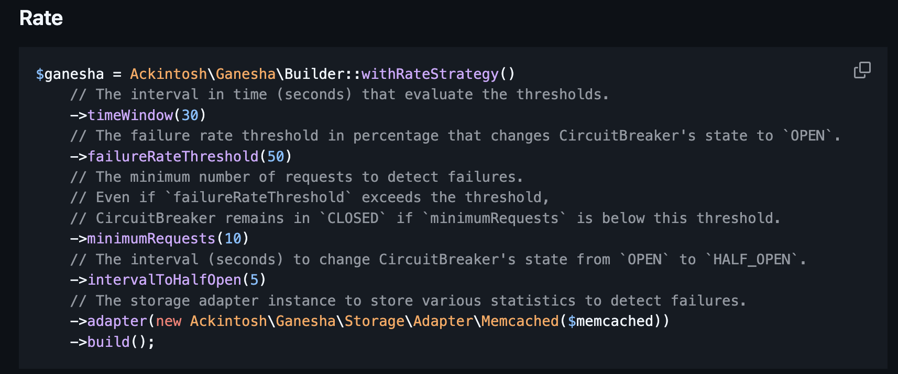
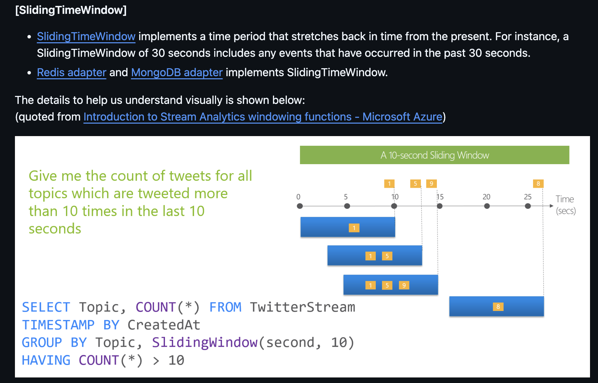

## Rate Strategy

Trips the circuit based on the **failure rate (%)** over a sliding time window,
instead of a fixed failure count.

- Better suited for **high-traffic services**
- A fixed count doesn't scale — 3 failures out of 10 vs. 3 out of 10,000 mean very different things
- The API is identical to the Count strategy — same `isAvailable()` / `success()` / `failure()`

